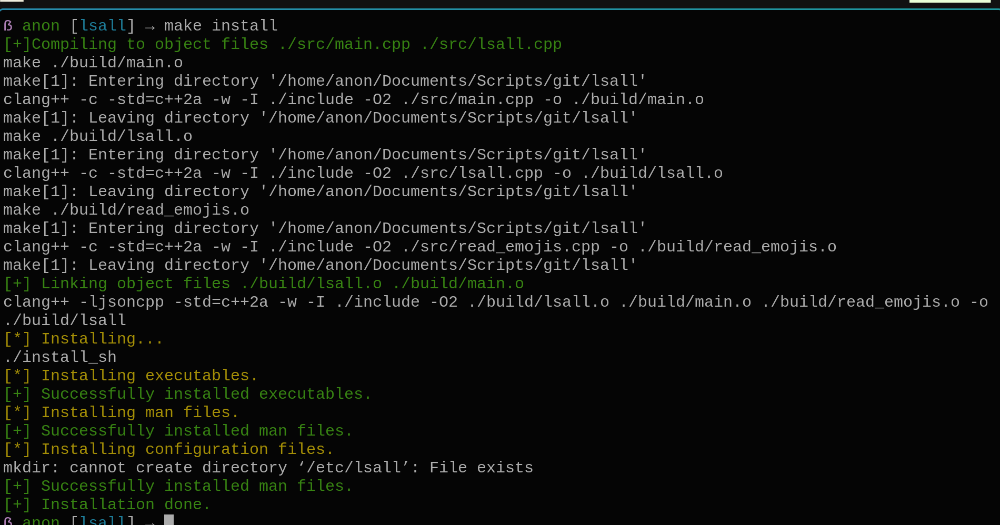
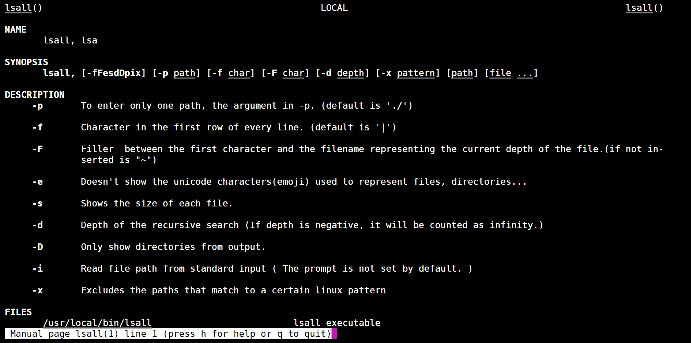

# lsall

`lsall` is a project that focuses on the tree-like visualization of a directory, with various arguments.

---
## Installation

For Linux the installation is simple

1. Download the project via git

```bash
git clone https://github.com/fractal27/lsall.git
```

2. Run `make install`

and just run in bash the simple command while in the cloned project



If you are intruigued at how the installation process works, it just uses a combination of Makefile and some copy commands to add the executable files to the directory `/usr/local/bin/` and the manual(man1) page to the directory `/usr/share/man/man1`.

*NOTE*: Windows and MacOS installation is not yet implemented. but can be achieved via
`make`, moving the binaries to path and running the program


---
## Usage
The usage of `lsall` is:

    lsall [options] [file1] [file2...]

And here are the various options:

```
-p To enter only one path, the argument in -p. (default is \'./\')
-f Character in the first row of every line. (default is \'\|\')
-F Filler between the first character and the filename representing the
    current depth of the file.(if not inserted is \"\~\")
-e Doesn\'t show the unicode characters(emoji) used to represent files,
    directories\...
-s Shows the size of each file.
-d DEPTH Depth of the recursive search (If depth is negative, it will be
    counted as infinity.)
-D Only show directories from output.
-i Read file path from standard input ( The prompt is not set by default. )
```
## Examples

If you want to use to display a the tree of your project without all the directories and you are
using a terminal without UNICODE emoji support, you can use the `-e` to not show emojis.

And use the flag `-d` to set the depth to the level you prefer, for example:

```bash
$ lsall -e -d 1
[.]
|~(d) src
|~~~(r) main.cpp
|~~~(r) lsall.1
|~~~(r) lsa.cpp
|~(d) include
|~~~(r) lsall.h
|~(r) .gitignore
|~(r) README.md
|~(d) .git
|~~~(r) index
|~~~(r) HEAD
|~~~(d) branches
|~~~(r) config
|~~~(r) description
|~~~(r) FETCH_HEAD
|~~~(d) hooks
|~~~(r) COMMIT_EDITMSG
|~~~(d) objects
|~~~(d) info
|~~~(r) ORIG_HEAD
|~~~(d) refs
|~~~(d) logs
|~(r) install
|~(d) build
|~~~(r) main.o
|~~~(r) lsa.o
|~~~(r) lsall
|~(r) Makefile
|~(d) screenshots
|~~~(r) installation_linux.png
|~~~(r) lsall_manpage.png
```

If you want to ignore a specific pattern of name or directory (e.g `.git`) you can do that using the argument `-x`(x for delete from visible)

```bash
$ lsall -d1 -x ".git"
[.]
|~📁 src
|~~~📃 main.cpp
|~~~📃 lsall.1
|~~~📃 lsall.cpp
|~📁 include
|~~~📃 lsall.h
|~~~📁 build
|~~~📁 gtest
|~📃 .gitignore
|~📃 README.md
|~📃 install
|~📁 build
|~~~📃 lsall
|~~~📃 main.o
|~~~📃 lsall.o
|~📃 Makefile
|~📁 screenshots
|~~~📃 installation_linux.png
|~~~📃 lsall_manpage.png
```

## man page

The [manual page](src/lsall.1)(man1) is a man1 made page of the lsall project, and 
it is automatically installed using `make install`.

You can access it using the normal `man lsall` if the program is installed globally, but if you don't want to install it, you can still look at the manual using the relative path: `man src/lsall.1`.

Here is a screenshot of the manpage from the current version of the man page of lsall.




